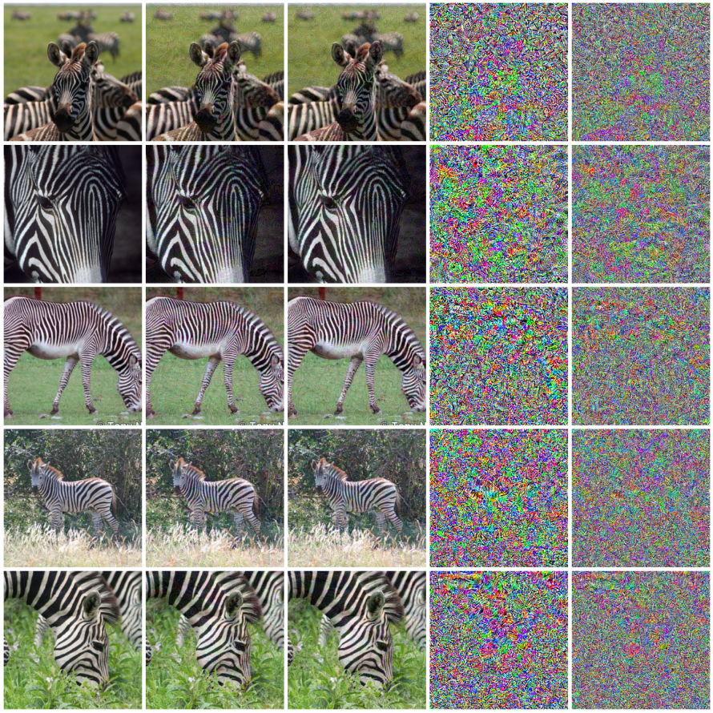
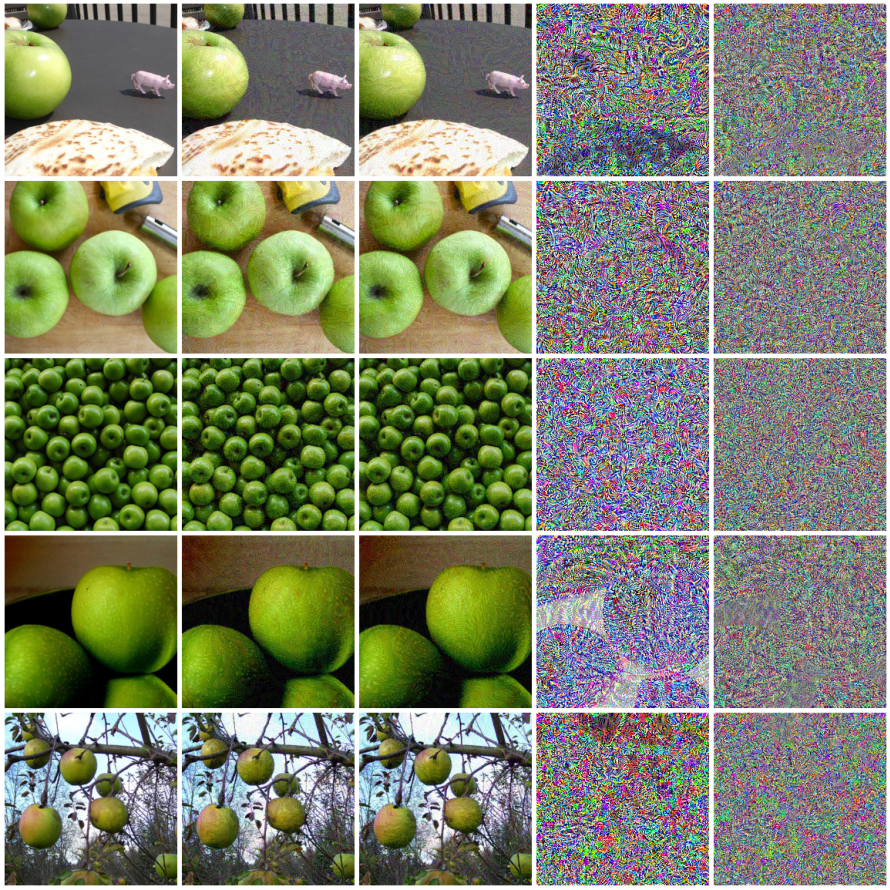
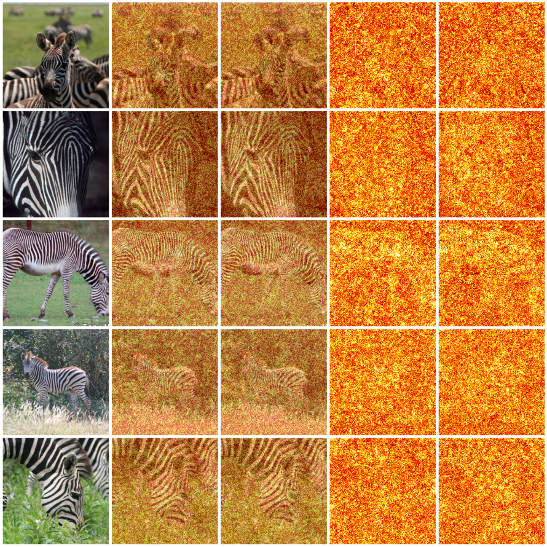
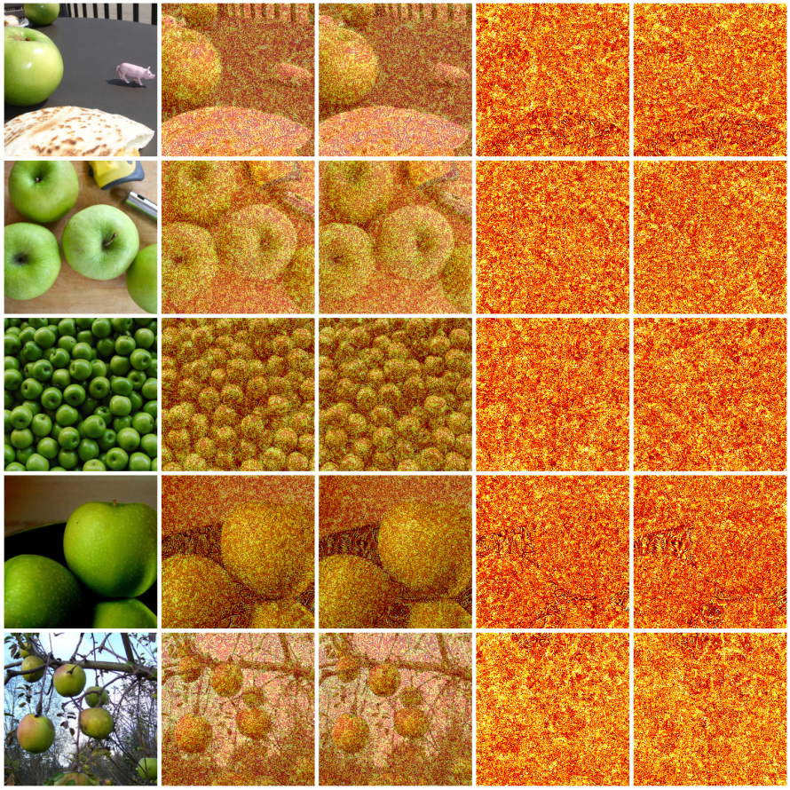
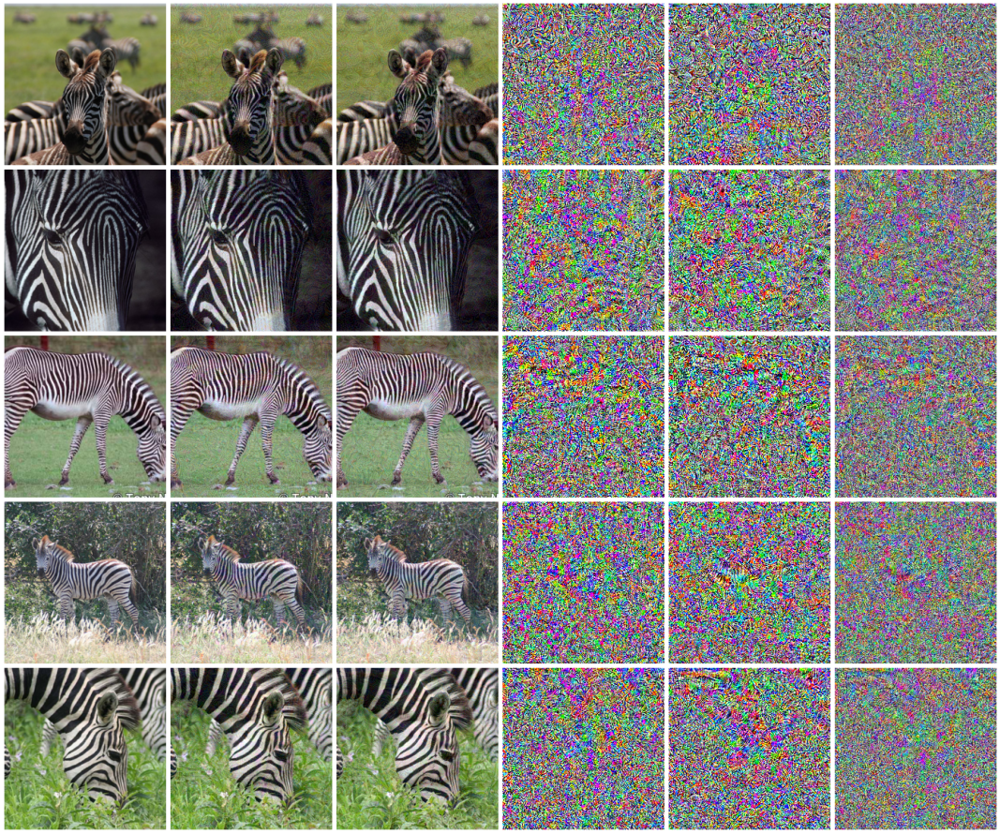
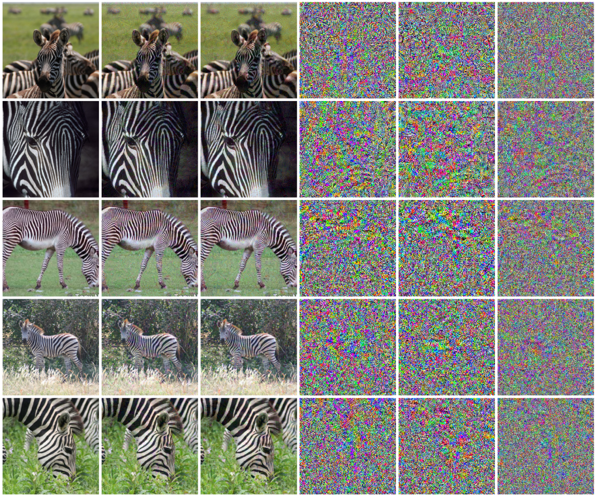

# CGAA: Concept-Guided Adversarial Attacks

[](LICENSE)
[](https://www.python.org/)
[](https://pytorch.org/)
[](https://doi.org/10.5281/zenodo.20574533)

This repository is preserved as a documented negative result
with full reproducible code and artifacts.

---

## What this is

CGAA extends the Basic Iterative Method (BIM) adversarial attack with a concept-steering
term. The loss function becomes:

$$\mathcal{L}(x) = \mathrm{CE}(f(x), y) + \lambda \cdot d \cdot \langle \overline{a_\ell(x)},\, v_c \rangle$$

where $v_c$ is a Concept Activation Vector trained on texture images from the
Describable Textures Dataset (DTD), $\overline{a_\ell(x)}$ denotes spatially
mean-pooled activations at layer $\ell$, and $d \in \{+1, -1\}$ controls the
push direction.

The original question: can an adversarial perturbation, constrained to be imperceptible
($\lVert\delta\rVert_\infty \leq \varepsilon = 16/255$), cause a classifier to stop "seeing"
a concept in an image? For example, can you make a zebra look conceptually stripe-free
to the model, without visibly removing the stripes?

---

## What was found

Phase 1 smoke tests (ResNet-50, ImageNet, layer4, DTD striped and dotted CAVs,
5 images per class, 50 attack steps, $\varepsilon = 16/255$, $\lambda = 100$):

| Attack | $\Delta$(train CAV) | ASR | L2 |
|---|---|---|---|
| Zebra BIM | -105.9 | 1.00 | 7.04 |
| Zebra CGAA (d=-1, striped) | -359.3 | 1.00 | 7.04 |
| Zebra CGAA (d=+1, striped) | +345.9 | 0.00 | 6.93 |
| Zebra CGAA (d=+1, dotted) | +82.3 on striped CAV | 1.00 | 7.06 |
| Apple BIM | -26.1 | 1.00 | 6.77 |
| Apple CGAA (d=+1, striped) | +331.1 | 1.00 | 6.76 |

**Finding 1: CGAA moves the model's concept representation 3-13x more than BIM at matched L2, while remaining visually imperceptible** -- consistent with the $L_{\infty}$-bounded adversarial regime. The perturbation does what it was designed to do: shift the model's internal representation of the concept without touching the image in any visible way.

**Test 1 - Eyeball grid** (columns: Original · BIM · CGAA · Δ CGAA vs orig · Δ CGAA vs BIM):



*Zebra: suppress stripes (d=-1). Stripes remain fully present in the CGAA column.*



*Apple: inject stripes (d=+1). No stripe pattern appears on any apple surface.*

**Test 2 - Perturbation localization** (columns: Original · BIM overlay · CGAA overlay · BIM |δ| · CGAA |δ|):



*Perturbation-magnitude maps for both BIM and CGAA are uniform over the whole image. CGAA does not concentrate on the zebra body.*



**Test 3 - Direction symmetry** (columns: Original · CGAA d=+1 · CGAA d=-1 · Δ(+1) · Δ(−1) · Δ(+1 vs −1)):



*d=+1 and d=-1 produce visually identical outputs despite opposite-signed $\Delta$ values (+346 vs −359). The direction parameter has no visible effect.*

**Test 4 - Cross-concept distinctness** (columns: Original · CGAA striped · CGAA dotted · Δ striped · Δ dotted · Δ striped vs dotted):



*Striped-CAV and dotted-CAV attacks produce near-identical perturbations on the same zebra.*

**Finding 2: Attacking along the dotted direction moves the striped probe (+82).** When CGAA steers toward the dotted CAV direction, the striped CAV score increases by $+82.3$ units. This is the more consequential result: the two concept directions are not orthogonal at layer4, meaning a single CAV does not isolate one concept cleanly. Moving one concept's probe also moves another's.

---

## Diagnosis

### The mean-pool pathology

The CGAA loss uses spatially mean-pooled activations. The gradient of the concept
term with respect to the feature map is:

$$\frac{\partial}{\partial a_\ell[c, h, w]} \langle \overline{a_\ell}, v_c \rangle = \frac{v_c[c]}{H \cdot W}$$

Spatially uniform. Every pixel receives the same scaled CAV weight, independent of
position. The attack has no reason to prefer the zebra's body over background, and
empirically it does not. The CAV dot-product is moved by accumulating tiny,
spatially-incoherent pixel changes whose arithmetic mean happens to align with
$v_c$ in feature space.

### The category error

Adversarial attacks are imperceptible by construction. The $\lVert\delta\rVert_\infty \leq \varepsilon$
budget exists specifically so the perturbation fools the model without being visible.
Asking an adversarial attack to visibly suppress stripes is asking for two contradictory
properties at once. The smoke-test failure confirms that CGAA is behaving correctly as
an $L_{\infty}$-bounded attack, not that it is uniquely broken.

If visible concept removal is the goal, the right class of methods is counterfactual
image editing: diffusion-based counterfactuals, StyleGAN latent editing, or
concept-bottleneck interventions.

### The adversarially fragile probe

A large $\Delta$ on a training CAV is not sufficient evidence of concept shift. It
can be produced by in-sample probe fragility without any genuine concept motion. This
echoes Ghorbani, Abid, Zou (2019) on saliency map fragility; the specific application
to CAV-style probes is the main takeaway of this study.

---

## Why it was archived

**Finding 1** is near-tautological. Adversarial movability of a differentiable linear
probe follows from basic calculus. A reviewer's response is predictable: TCAV is used
on natural images, not adversarial ones, so adversarial movability is not a validity
concern for the measurement on clean data.

**Finding 2** (CAV entanglement) is already published:

> Nicolson, Schut, Noble, Gal. "Explaining Explainability: Recommendations for
> Effective Use of Concept Activation Vectors." TMLR, February 2025.
> https://arxiv.org/abs/2404.03713

They use a synthetic dataset with three co-occurrence regimes (zero, partial, perfect)
and show that CAV entanglement is proportional to co-occurrence and inflates TCAV
reliance scores for uninformative attributes.

Additional prior work:
- Bahadori and Heckerman (ICLR 2021): debiasing concept-based explanations; frames
  correlation-confound as the central TCAV problem.
- Mahinpei et al. (2021): concept leakage in concept-bottleneck models.
- Erogullari et al. (2025): co-occurrence causes non-orthogonal CAVs; proposes an
  orthogonality loss.
- Crabbé and van der Schaar (NeurIPS 2022): CAVs generalized to regions.

---

## What was not tried

1. **Replace mean-pool with max-pool** in the loss. The gradient becomes non-zero
   only at the argmax spatial position per channel:
   $$\frac{\partial}{\partial a_\ell[c, h, w]} \max_{h',w'}(a_\ell[c, h', w']) \cdot v_c[c]$$
   The attack would be forced to concentrate on specific locations.

2. **Add a saliency mask** (e.g. GradCAM) and restrict $\delta$ to high-saliency pixels.

3. **Attack at lower layers** (layer2, layer3) where spatial resolution is higher.

4. **Much larger $\lambda$** ($10^3\text{-}10^5$), at the cost of classification success.

---


## Repository structure

```
cgaa/
  attacks.py    BIM and CGAA attack classes
  cav.py        CAV training via SGD linear classifier on pooled activations
  config.py     YAML config loading and deep merge
  data.py       DataLoaders for ImageNet target classes and DTD concept images
  metrics.py    Attack success rate, concept-score delta, L2 distance
  model.py      ResNet backbone with prepended Normalize layer
  tracker.py    Per-step activation and gradient recorder (callback interface)
  viz.py        Trajectory plots, heatmaps, flow fields, t-SNE, layer drift

configs/
  default.yaml
  experiments/zebra_stripes.yaml
  experiments/apple_stripes.yaml

scripts/
  train_concepts.py
  run_attack.py
  smoke_tests.py

dtd/images/
results/cavs/         striped_layer4.pt, dotted_layer4.pt
assets/        figures above
```

See [SETUP.md](SETUP.md) for installation and running instructions.

---

## Citation

```bibtex
@software{mukhtar_cgaa_2026,
  author    = {Mukhtar, Muhammad Taha},
  title     = {CGAA: Concept-Guided Adversarial Attacks},
  year      = {2026},
  publisher = {Zenodo},
  doi       = {10.5281/zenodo.20574533},
  url       = {https://doi.org/10.5281/zenodo.20574533}
}
```

## References

- Kim et al. (2018). Interpretability Beyond Feature Attribution: TCAV. ICML.
- Kurakin, Goodfellow, Bengio (2017). Adversarial Examples in the Physical World. ICLR Workshop.
- Ghorbani, Abid, Zou (2019). Interpretation of Neural Networks is Fragile. AAAI.
- Nicolson, Schut, Noble, Gal (2025). Explaining Explainability. TMLR.
- Bahadori, Heckerman (2021). Debiasing Concept-based Explanations with Causal Analysis. ICLR.
- Crabbé, van der Schaar (2022). Concept Activation Regions. NeurIPS.
- Cimpoi et al. (2014). Describing Textures in the Wild. CVPR.
